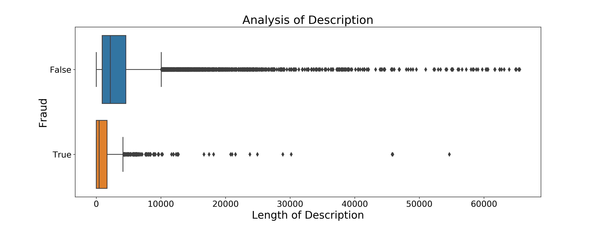

# Case Study - Predicting Fraud  
- Jarred Bultema, Daniel Kim, Alyse Record, Peter Schmeiser  

### Method  
Tasked with predicting fraud for an event-ticketing company:    
- We conducted a thorough EDA by analyzing data provided by the company  
  - Cleaned the dataset, utilized feature engineering, generated plots  
- Experimented with several different models to obtain performance metrics
- Implemented steps to obtain probabilities for fraudulent activity 
  - Set probability thresholds for fraud rather than simple yes/no classification  
- Developed a Flask app capable of taking in random data for prediction

### Data
The full dataset is composed of over 14,000 events with various numerical and categorical features. Data leakage was a major concern, and rigorous analysis was used to prevent leakage. Class imbalance between fraud and non-fraud cases (9% vs 91%) may present issues in modeling.

In exploratory data analysis, we found the following features to show large variable between Fraud and non-Fraud events.

  

These features, among others, were used for modeling. Along with rigorous feature engineering and the conversion to dummied categorial features, we were left with 228 features. After conversion to binary classification, we removed those features with little utility or viable relationships according to our EDA.

### Modeling   
Ultimately, the Random Forest classifier performed best for our task. Our boosted models, XGBoost and Gradient Boosting, also performed well and comparably to Random Forest. Naive Bayes Classification, on the other hand, lagged behind the others by a considerable amount. Ultimately, the choice to go with Random Forest was primarily one aimed at interpretibility, drawing out feature importances, and with a consideration of audience.

### Deployment
We deployed a flask app that uses live streaming data, makes Fraud predictions, and logs predictions.

